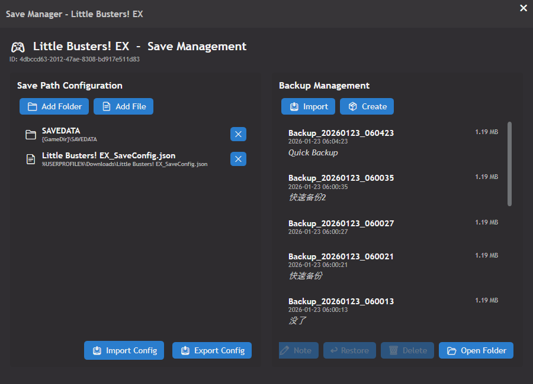
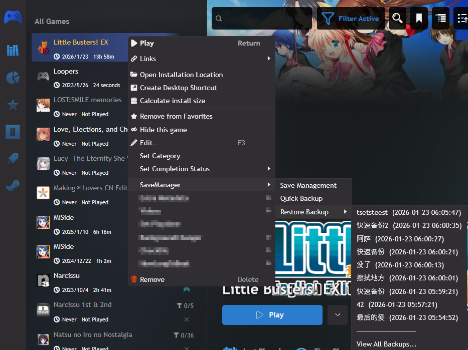
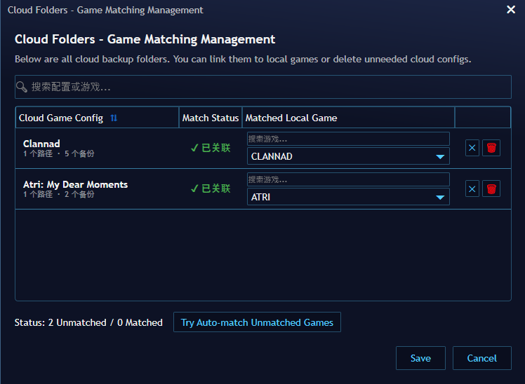

<div align="center">

# 🎮 Playnite Save Manager

[](https://github.com/Jurangren/save-manager/releases)
[](https://github.com/Jurangren/save-manager/releases)
[](https://github-release-stats.ghostbyte.dev/Jurangren/save-manager)

**[English]** | [中文](README_CN.md)

</div>

&emsp;&emsp;A **save manager plugin** designed for the Playnite game library. Easily backup, restore, and manage your PC game saves, and never worry about losing or corrupting your saves again!

## ✨ Core Features

- **☁️ Cloud Sync**: Support syncing multiple saves to the cloud for cross-device backup.
- **⚡ Smart Path Detection**: Automatically recognizes save paths and adapts if the game directory moves.
- **📦 One-Click Backup**: Supports quick backups with optional notes (e.g., "Before Boss", "Route A Clear").
- **↩️ Safe Restore**: Restore saves to any previous state at any time.
- **🚫 Restore Exclusions**: Exclude specific files during restore (e.g., global settings, read text history, graphics settings).
- **📂 Portable Design**: Backup files support moving with the game directory; supports relative paths.
- **📤 Import/Export**: Support importing/exporting save path configurations and external ZIP backup packages.
- **🌍 Global Config**: Support exporting/importing all configurations for easy backup across machines.
- **🧹 Auto Cleanup**: Automatically cleans up residual empty folders when deleting the last backup.

## 📸 Screenshots

### Main Interface


### Context Menu


### Game Matching


## 📖 User Guide

### 1. Configure Save Path

1. Select a game, right-click **"SaveManager"** → **"Manage Saves"**.
2. Click **"📁 Add Folder"** or **"📄 Add File"**.
3. Select your game archive location (usually `Documents\GameName` or the `Save` folder under the game installation directory). The plugin will automatically detect and optimize the path:
   - `%USERPROFILE%`: User profile folder, covering `Documents`, `AppData`, etc.
   - `{GameDir}`: The installation directory of the game.
   - `{EmulatorDir}`: The installation directory of the emulator used by the game.


### 2. Create Backup

- **Method A**: Click the **"📦 Create Backup"** button in the Manager interface.
- **Method B**: Right-click a game in the Playnite list → **"SaveManager"** → **"Quick Backup"**.

### 3. Restore Save

1. In the Manager interface, select the backup you want to restore from the list.
2. Click the **"↩️ Restore"** button.
3. Confirm overwriting.

Or use the context menu:
- Right-click game → **"SaveManager"** → **"Restore Backup"** → Select one from the last 9 backups.

### 4. Restore Exclusions (Advanced)

If you wish to **keep** certain local settings when restoring a save (e.g., resolution, key bindings, visual novel read history):

1. Find the **"🚫 Restore Exclusions"** area below "Save Path Configuration".
2. Click **"📁 Add Folder"** or **"📄 Add File"**.
3. Select the files you want to protect (e.g., `config.ini`, `global.dat`, `system.sav`).
4. These files will remain in their current state and will not be overwritten by old files in the backup during any future restore.

### 5. Other Features

- **Edit Note**: Want to change the note after backing up? Click the **"✏️"** button in the list.
- **Import/Export Config**: Share your configuration with friends using the **"📥/📤"** buttons at the bottom of the interface.
- **Global Management**: Perform global import/export and open the plugin data directory in **Playnite Settings** → **Extensions** → **Save Manager**.

## 🛠️ Installation

### Install from Playnite Add-on Database (Recommended)
1. Open Playnite → Press `F9` or go to **Add-ons** → **Browse**.
2. Search for **"Save Manager"**.
3. Click **Install**.
4. Restart Playnite.

### Manual Installation
1. Download the latest `.pext` plugin file from [Releases](../../releases).
2. Drag and drop it into the Playnite window or go to **Add-ons** -> **Install from file**.
3. Restart Playnite.

## ☁️ Cloud Sync Guide

This plugin uses **Rclone** to implement cloud backup synchronization.

1. **Enable**: Check **"Enable Cloud Sync"** in the **"Cloud Sync"** tab of the plugin settings.
2. **Configure**: Click the cloud service provider dropdown, select the cloud service type, and then click **"Configure Cloud Service"** to start the wizard and authorize the cloud service to Rclone. It will automatically initialize cloud sync and prompt for the first push (which may take a long time).
3. **Verify Connection**: Click the **"Test Connection"** button to verify if cloud sync is configured successfully and to get the last sync time from the cloud service.
4. **Verify Cloud Backup Availability**: Cloud sync is currently experimental. Issues may occur with uploading and deleting backups. Click the **"Verify Cloud Backups"** button to check if all backup files in the current configuration are available in the cloud.

## ⚙️ Other Settings Options

Go to **Playnite Settings** → **Extensions** → **Save Manager**:

- **Auto backup when game stops**: Automatically create a backup when the game exits.
- **Max backup count**: Maximum number of backups per game (0 = unlimited).
- **Auto-backup Windows Notification**: Detailed Windows notification after background auto-backup completes.
- **Global Management**: Supports exporting/importing full ZIP packages containing configurations and backups.
- **Game Matching**: When importing from cloud backup, configure which local games the cloud game saves rely on.
- **Sync Config Before Game Start**: Will pull the SaveManager configuration from the cloud before the game starts, and check if there are newer backups in the cloud.
  - **Note**: Enabling this feature will increase game startup time. Restoring backups requires waiting for background uploads to complete, otherwise, it may unconditionally pull the latest save from the cloud or cause save conflicts.
- **Version Tracking**: When enabled, records the CRC32 checksum of each save as version information, providing a basis for automatically resolving save conflicts in the future.
  - Highly recommended if you plan to use cloud sync features.

## 🌐 Localization

The plugin supports multiple languages:
- **English** (en_US)
- **Simplified Chinese** (zh_CN)

The language will automatically switch based on Playnite settings.

## 📁 File Structure

```
%AppData%\Playnite\ExtensionsData\SaveManager\
├── config.json       # Configuration of save paths and backup records for all games
├── settings.json     # Global plugin settings (auto backup, etc.)
├── Tools\            # Tools directory
│   ├── rclone.exe    # rclone executable (for cloud sync)
│   └── rclone.conf   # rclone configuration file
└── Backups\          # Backup data set
    └── {ConfigId}\
        ├── Backup_YYYYMMDD_HHMMSS.zip
        └── ...
```

## 🙏 Acknowledgments

- **Playnite**: [https://playnite.link/](https://playnite.link/) - An excellent open-source game launcher.
- **Rclone**: [https://rclone.org/](https://rclone.org/) - An excellent open-source cloud sync tool.
- **SaveTracker**: [https://github.com/KrachDev/SaveTracker](https://github.com/KrachDev/SaveTracker) - Provided valuable reference and inspiration for the implementation of cloud sync features.

## 🤝 Contribution

Contributions are welcome! You can:
- Report bugs or suggest features in [Issues](../../issues).
- Submit Pull Requests.
- Help translate into other languages.

## 📄 License

This project is licensed under the MIT License.

---

*Made with ❤️ for Playnite gamers*
