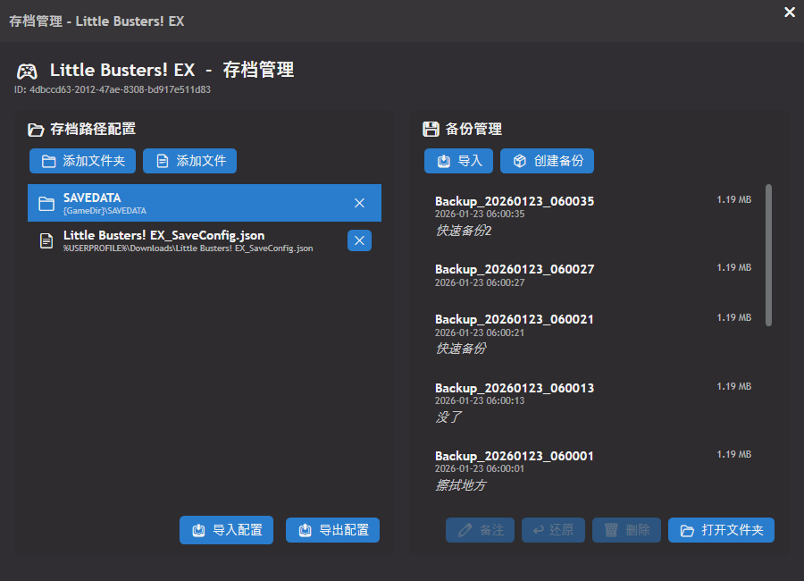
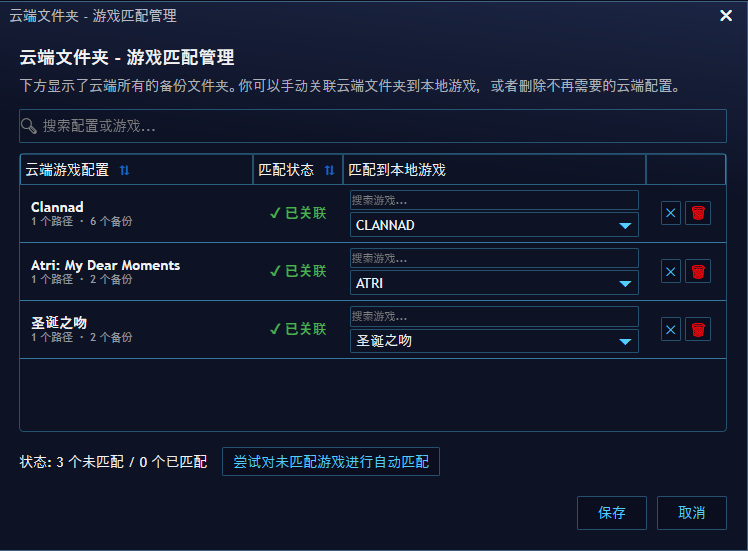

<div align="center">

# 🎮 Playnite 存档管理器 (Save Manager)

[](https://img.shields.io/github/release-date/Jurangren/save-manager)
[](https://github.com/Jurangren/save-manager/releases)
[](https://github.com/Jurangren/save-manager/releases)
<br>

[](playnite://playnite/installaddon/SaveManager)


[English](README.md) | **[中文]**

</div>

&emsp;&emsp;这是一个专为 Playnite 游戏库设计的**存档管理插件**。它让你能够轻松备份、还原和管理 PC 游戏的存档，再也不用担心存档丢失或损坏！

## ✨ 核心功能

- **☁️ 云同步**：支持将多个存档同步到云端，实现跨设备备份
- **⚡ 智能路径识别**：自动识别存档路径，游戏目录移动后自动适配
- **📦 一键备份**：支持快速备份，并可添加备注（如"通关前"、"Boss战前"）
- **↩️ 安全还原**：随时将存档恢复到之前的任意状态
- **🚫 还原排除项**：还原时可排除特定文件（如全局设置、读过的文本记录、画质设置等）
- **📂 便携化设计**：备份文件支持随游戏目录移动，相对路径自动识别
- **📤 导入导出**：支持导入/导出存档路径配置和外部 ZIP 备份包
- **🌍 全局配置**：支持导出/导入所有配置，方便跨机器备份
- **🧹 自动清理**：删除最后一个备份时，自动清理残留的空文件夹

## 📸 截图预览

### 主界面


### 右键菜单


### 游戏匹配界面


## 📖 使用指南

### 1. 配置存档路径

1. 选中游戏，右键点击 **"存档管理-SaveManager"** → **"存档管理"**
2. 点击 **"📁 添加文件夹"** 或 **"📄 Add File"**
3. 选择你的游戏存档位置（通常是 `Documents\游戏名` 或游戏安装目录下的 `Save` 文件夹）, 插件会自动检测并优化路径:
   - `%USERPROFILE%`: 用户配置文件夹，向下涵盖`Documents`、`AppData`等
   - `{GameDir}`: 该游戏的安装目录
   - `{EmulatorDir}`: 该游戏所使用的模拟器的安装目录


### 2. 创建备份

- **方法 A**：在管理器界面点击 **"📦 创建备份"** 按钮
- **方法 B**：在 Playnite 游戏列表右键一款游戏 → **"存档管理-SaveManager"** → **"快速备份"**

### 3. 还原存档

1. 在管理器界面中，从备份列表选中你想恢复的备份
2. 点击 **"↩️ 还原"** 按钮
3. 确认覆盖即可

或者使用右键菜单：
- 右键游戏 → **"存档管理-SaveManager"** → **"还原备份"** → 从最近9个备份中选择一个

### 4. 还原排除项（进阶）

如果你希望在还原存档时**保留**某些本地设置（如分辨率、按键绑定、视觉小说的已读跳转记录等）：

1. 在“存档路径配置”下方找到 **"🚫 还原排除项"** 区域
2. 点击 **"📁 添加文件夹"** 或 **"📄 添加文件"**
3. 选择你想保护的文件（例如：`config.ini`, `global.dat`, `system.sav` 等）
4. 之后还原任何备份时，这些文件都会保持当前状态，不会被备份中的旧文件覆盖。

### 5. 其他功能

- **修改备注**：备份后想改备注？直接在列表中点击 **"✏️"** 按钮
- **导入/导出配置**：使用界面下方的 **"📥/📤"** 按钮可以分享你的配置给朋友
- **全局管理**：在 **Playnite 设置** → **扩展** → **Save Manager** 中可以进行全局导入/导出及打开插件数据目录

## 🛠️ 安装方法

### 从 Playnite 插件商店安装（推荐）

[](playnite://playnite/installaddon/SaveManager)

> 👆 点击上方按钮即可直接安装，或按照以下步骤在插件商店中手动安装：

1. 打开 Playnite → 按 `F9` 或进入 **扩展** → **浏览**
2. 搜索 **"Save Manager"**
3. 点击 **安装**
4. 重启 Playnite

### 手动安装
1. 从 [Releases](../../releases) 下载最新的 `.pext` 插件文件
2. 拖入 Playnite 窗口或通过 **扩展** → **从文件安装**
3. 重启 Playnite

## ☁️ 云同步指南

本插件利用 **Rclone** 实现云备份同步。

1. **启动**：在插件设置的 **"云同步"** 标签页中，勾选 **"启用云同步"**。
2. **配置**: 点击云服务提供商下拉框，选择云服务类型，之后点击 **"配置云服务"** 启动向导，授权云服务到 Rclone。随后会自动初始化云同步，并提示进行首次推送(时间较长)。
3. **验证连接**：点击 **"验证连接"** 按钮，可以验证云同步是否配置成功，并获取云服务中最后同步配置的时间。
4. **验证云端备份可用性**：云同步目前处于实验初期，针对云服务的备份上传和删除可能会存在问题。点击 **"验证云端备份可用性"** 按钮，可以验证当前配置中的所有备份文件是否在云端可用。

## ⚙️ 其他设置选项

进入 **Playnite 设置** → **扩展** → **Save Manager**：

- **游戏结束时自动备份**：游戏退出时自动创建备份
- **最大备份数量**：每个游戏的最大备份数（0 = 不限制）
- **自动备份Windows通知**: 当后台自动备份完成时，会弹出Windows通知
- **全局管理**：支持导出/导入包含配置和备份在内的完整 ZIP 包
- **游戏匹配**: 从云备份导入时，配置云中的游戏存档与哪些本地游戏进行关联
- **游戏启动前同步配置**: 将会在游戏启动前，拉取云端的SaveManager配置，并检查云端是否有更新的备份。
  - **注意**：启用该功能会增加游戏启动时间，并且还原备份时需要等待后台上传完成后才能启动游戏，否则会导致无条件拉取云端最新存档或者造成存档冲突。
- **版本记录**: 启用后会记录每个存档的CRC32校验值，作为存档的版本信息，为后续自动解决存档冲突提供依据。
  - 如果未来打算使用云同步功能，强烈建议启用此功能。

## 🌐 本地化

插件支持多种语言：
- **English** (en_US)
- **简体中文** (zh_CN)

语言会根据 Playnite 设置自动切换。

## 📁 文件结构

```
%AppData%\Playnite\ExtensionsData\SaveManager\
├── config.json       # 所有游戏的存档路径配置及备份记录信息
├── settings.json     # 插件全局设置（自动备份等）
├── Tools\            # 工具目录
│   ├── rclone.exe    # rclone程序 (用于云同步)
│   └── rclone.conf   # rclone配置文件
└── Backups\          # 存档数据集
    └── {ConfigId}\
        ├── Backup_年月日_时分秒.zip
        └── ...
```

## 🙏 致谢

- **Playnite**: [https://playnite.link/](https://playnite.link/) - 优秀的开源游戏启动器
- **Rclone**: [https://rclone.org/](https://rclone.org/) - 优秀的开源云同步工具
- **SaveTracker**: [https://github.com/KrachDev/SaveTracker](https://github.com/KrachDev/SaveTracker) - 为云同步功能的实现提供了宝贵的参考与灵感

## 🤝 贡献

欢迎贡献！你可以：
- 在 [Issues](../../issues) 中报告 Bug 或提出功能建议
- 提交 Pull Request
- 帮助翻译成其他语言

## 📄 许可证

本项目采用 MIT 许可证。

---

*用 ❤️ 为 Playnite 玩家打造*
